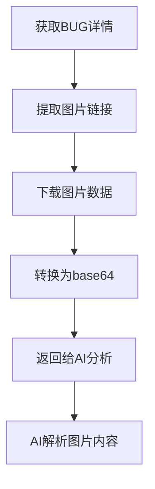

# RDMS MCP Server

这是一个专为RDMS BUG跟踪系统设计的MCP服务器，让Cursor能够直接读取和操作RDMS系统中的BUG信息，并支持AI图片分析功能。

## 功能特性

- 🔐 **自动登录** - 支持RDMS系统的用户认证
- 🐛 **BUG详情** - 根据BUG ID获取完整的BUG信息
- 🖼️ **图片分析** - 自动提取并分析BUG附件图片，支持AI视觉解析
- 🔍 **搜索功能** - 支持多条件搜索BUG
- 📋 **列表获取** - 获取项目的BUG列表
- 👤 **我的BUG** - 查看分配给当前用户的BUG
- 📊 **工作面板** - 获取工作面板统计信息
- ⏳ **待处理BUG** - 查看待处理的BUG列表
- 🏪 **市场缺陷** - 查看分配给自己的市场缺陷
- 📥 **图片下载** - 下载RDMS系统中的图片附件

## 安装步骤

1. 安装依赖：
```bash
npm install
```

2. 在Cursor中配置MCP服务器，在设置中添加：
```json
{
  "mcpServers": {
    "rdms": {
      "command": "node",
      "args": ["path/to/rdms-mcp-server/index.js"],
      "env": {
        "RDMS_BASE_URL": "https://rdms.streamax.com",
        "RDMS_USERNAME": "your_username",
        "RDMS_PASSWORD": "your_password"
      }
    }
  }
}
```

## 使用方法

### 1. 登录RDMS系统
```javascript
// 使用rdms_login工具
{
  "baseUrl": "https://rdms.streamax.com",
  "username": "your_username",
  "password": "your_password"
}
```

### 2. 获取BUG详情（含图片分析）
```javascript
// 使用rdms_get_bug工具
{
  "bugId": "141480",
  "analyzeImages": true  // 自动分析图片
}
```

### 3. 搜索BUG
```javascript
// 使用rdms_search_bugs工具
{
  "query": "登录问题",
  "status": "active",
  "assignedTo": "username",
  "limit": 20
}
```

### 4. 获取我的BUG
```javascript
// 使用rdms_get_my_bugs工具
{
  "status": "active",
  "limit": 20
}
```

### 5. 下载并分析图片
```javascript
// 使用rdms_download_image工具
{
  "imageUrl": "https://rdms.streamax.com/index.php?m=file&f=read&t=png&fileID=413370",
  "analyze": true  // 返回图片供AI分析
}
```

## 图片分析功能

RDMS MCP Server的核心特性是能够：

1. **自动提取图片** - 从BUG详情页面自动提取所有附件图片
2. **图片下载** - 支持下载RDMS系统中的图片文件
3. **AI视觉分析** - 将图片转换为base64格式，供AI助手进行视觉分析
4. **图片信息** - 提供图片的类型、大小等元数据信息

### 图片分析工作流程



## 支持的BUG信息字段

- ID、标题、状态、优先级、严重程度
- 指派人、报告人、所属产品、项目、模块
- 影响版本、操作系统、浏览器
- 重现步骤、描述、关键词
- 创建时间、更新时间
- **图片附件** - 自动提取并支持AI分析

## 环境变量配置

可以通过环境变量预设登录信息：

```bash
export RDMS_BASE_URL="https://rdms.streamax.com"
export RDMS_USERNAME="your_username"
export RDMS_PASSWORD="your_password"
```

## 注意事项

- 首次使用需要先调用`rdms_login`工具进行登录
- 登录状态会在会话期间保持
- 图片分析功能需要网络连接下载图片
- 大图片可能需要较长时间处理
- 网络超时设置为30秒

## 故障排除

如果遇到登录问题：
1. 检查网络连接和URL是否正确
2. 确认用户名密码是否正确
3. 检查RDMS系统是否需要验证码
4. 查看是否有IP限制或其他安全策略

如果遇到图片分析问题：
1. 确认图片URL是否可访问
2. 检查网络连接是否稳定
3. 验证图片格式是否支持

## 开发说明

本MCP服务器使用以下技术：
- Node.js + ES模块
- @modelcontextprotocol/sdk
- axios (HTTP客户端)
- cheerio (HTML解析)
- fs (文件系统操作)

## 测试

### 新版测试脚本（推荐）

使用改进的测试脚本来验证所有8个对外接口：

```bash
# 查看帮助
node test.js --help

# 运行所有测试
node test.js

# 运行单个测试
node test.js rdms_login
node test.js rdms_get_bug
node test.js rdms_search_bugs
node test.js rdms_get_my_bugs
node test.js rdms_get_market_defect
node test.js rdms_search_market_defects
node test.js rdms_get_market_defects
node test.js rdms_download_image
```

### 环境变量配置

```bash
# Windows PowerShell
$env:RDMS_BASE_URL="http://your-rdms-system.com"
$env:RDMS_USERNAME="your-username"
$env:RDMS_PASSWORD="your-password"

# Linux/Mac
export RDMS_BASE_URL="http://your-rdms-system.com"
export RDMS_USERNAME="your-username"
export RDMS_PASSWORD="your-password"
```

详细的测试使用指南请参考 [TEST_USAGE.md](./TEST_USAGE.md)

### 旧版测试脚本

```bash
node test.js <用户名> <密码> [测试类型]
```

测试类型：
- `all` - 运行所有测试
- `login` - 测试登录功能
- `bug` - 测试BUG获取功能
- `dashboard` - 测试工作面板
- `pending` - 测试待处理BUG
- `market` - 测试市场缺陷
- `my-bugs` - 测试我的BUG
